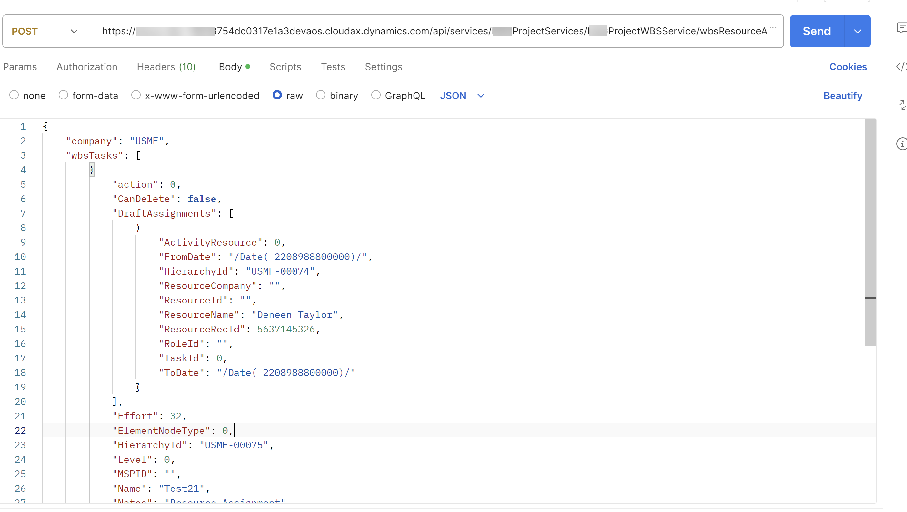

When you work on F&O Implementation and implementing project operations or Project management and accounting module you always come across Work breakdown structure. This Repo is going to contain code required to perform Integration and design modifications where resource assignments will be done to a Project WBS task from Power App into D365FO using standard and custom project services.
As a part of this repo contains following artifacts
- ASP_WBSIntegrationService.axpp - Project with Custom service code
- WBSResourceAssignment.json - JSON Sample which you can use to post data to custom service using Postman

## Posting JSON Paylot to custom service -
  1. Open the file (e.g "WBSResourceAssignment.json")

Post message to Service URL as shown below

